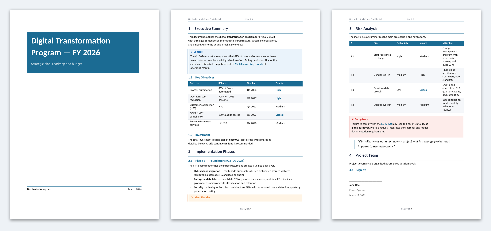
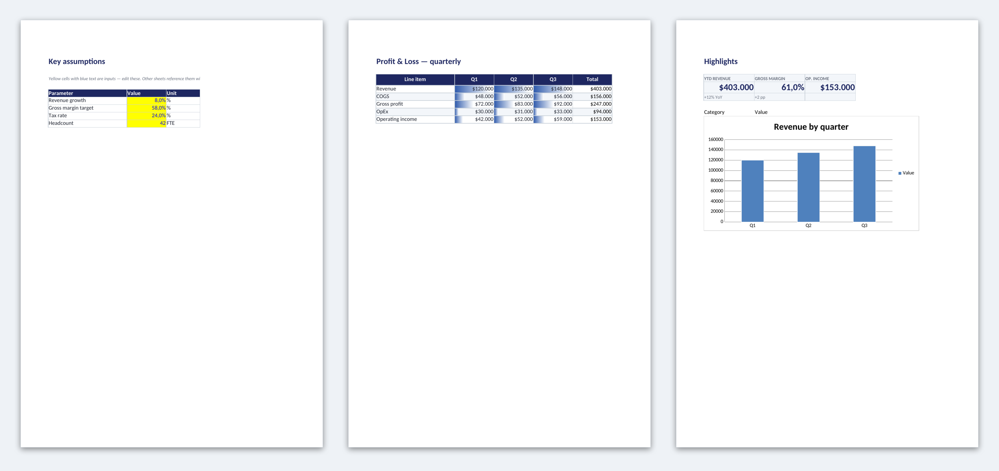

# NEURA Office

**Native Office files for AI chats.**

Your LLM can chat. NEURA Office makes it ship **Word**, **PowerPoint** and **Excel**.
Self-hosted. MIT. [Open WebUI](https://github.com/open-webui/open-webui) today.
Microsoft 365 assistant next. LibreOffice / OpenOffice where the format allows.

> Built by [IANUSTEC](https://ianustec.com) · License: MIT

<p align="center">
  
  
  
</p>

<p align="center">
  <sub>Real .docx / .pptx / .xlsx generated by the tools. Editable in Microsoft Office and LibreOffice.</sub>
</p>

## Why this exists

Most AI tools export HTML, PDF screenshots or Markdown. NEURA Office builds
**real Office Open XML** files with `python-docx`, `python-pptx` and `openpyxl`.

Open them in Word, PowerPoint, Excel, Pages, Keynote, Numbers, LibreOffice or
Google Sheets. Edit text, tables, charts and styles like any normal file.

Same idea as a Copilot-style assistant for documents, but:

- your models
- your data
- your Open WebUI backend
- open source (MIT)

## Components (live)

| Tool | Format | Latest | Repo |
|------|--------|--------|------|
| **Generate Documents** | `.docx` | [v1.2.0](https://github.com/ianustec/openwebui-generate-documents/releases/latest) | [openwebui-generate-documents](https://github.com/ianustec/openwebui-generate-documents) |
| **Generate Slides** | `.pptx` | [v1.0.2](https://github.com/ianustec/openwebui-generate-slides/releases/latest) | [openwebui-generate-slides](https://github.com/ianustec/openwebui-generate-slides) |
| **Generate Spreadsheets** | `.xlsx` | [v1.0.1](https://github.com/ianustec/openwebui-generate-spreadsheets/releases/latest) | [openwebui-generate-spreadsheets](https://github.com/ianustec/openwebui-generate-spreadsheets) |

Each tool is a **single self-contained `.py`** file. Paste it into
Open WebUI → Workspace → Tools. No extra services.

<details>
<summary>What each tool does</summary>

### Documents (Word)
Markdown or JSON in → native `.docx` out. Cover pages, numbered headings,
styled tables, callouts, TOC, header/footer, company letterhead (`.docx` / `.dotx`).

### Slides (PowerPoint)
JSON deck in → native `.pptx` out. ~25 layouts, native Office charts,
bundled Lucide-style icons, themes + custom accent.

### Spreadsheets (Excel)
JSON workbook in → native `.xlsx` out. Multi-sheet, Excel Tables, live formulas,
charts, freeze panes, validation, conditional formatting.

</details>

## Install in 60 seconds

1. Open one of the component repos above (or the [Open WebUI community](community/openwebui.md)).
2. Copy the `.py` file into **Workspace → Tools**.
3. Enable the tool for your model.
4. Ask: *"generate a board report / pitch deck / budget workbook"*.

Download link appears in chat via the Open WebUI Files API.

## Compatibility

| Output | Microsoft Office | LibreOffice / OpenOffice | Notes |
|--------|------------------|--------------------------|-------|
| `.docx` | Yes | Yes | Letterhead and complex covers: check layout |
| `.pptx` | Yes | Partial | Charts and some shapes may differ |
| `.xlsx` | Yes | Yes | Formulas recalculate on open |

Format is **OOXML** (the open Office standard), not a proprietary lock-in.
Details: [`libreoffice.md`](libreoffice.md).

## Roadmap

| Phase | Status | What |
|-------|--------|------|
| **Now** | Live | Three Open WebUI tools (Word / PowerPoint / Excel) |
| **Next** | In progress | Templates, letterhead polish, LibreOffice QA pack |
| **Later** | Planned | **NEURA for Microsoft 365**: add-in in Word / Excel / PowerPoint / Outlook, Open WebUI as backend (Copilot-shaped UX, your models) |

Full plan: [`ROADMAP.md`](ROADMAP.md) · MS365 notes: [`apps/ms365.md`](apps/ms365.md)

## Why “NEURA”?

Short version: NEURA is the AI platform we build at IANUSTEC (sovereign,
Open WebUI-based). This suite is the Office layer of that stack.

Longer story (when the site is ready): [`WHY-NEURA.md`](WHY-NEURA.md)

## This repo

This repository is the **hub**. It does not vendor the tool source.
Versioning, issues and releases live in the component repos.

```
neura-office/          ← you are here (overview + roadmap)
├── openwebui-generate-documents
├── openwebui-generate-slides
└── openwebui-generate-spreadsheets
```

## Links

- [IANUSTEC](https://ianustec.com)
- [Open WebUI](https://github.com/open-webui/open-webui)
- Community install notes: [`community/openwebui.md`](community/openwebui.md)

## License

MIT. See each component repo for its `LICENSE`.
