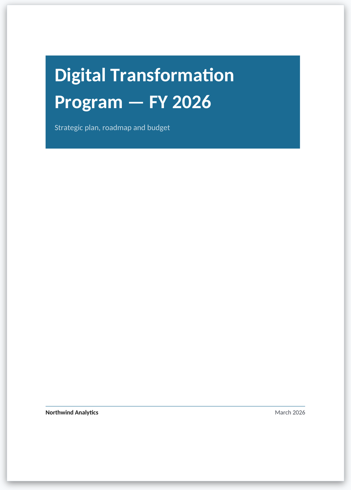
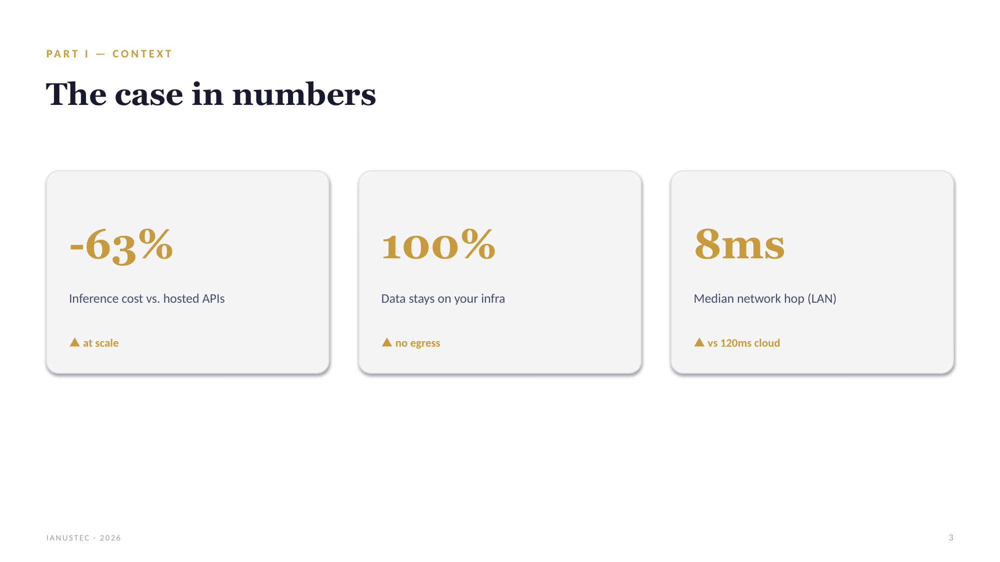
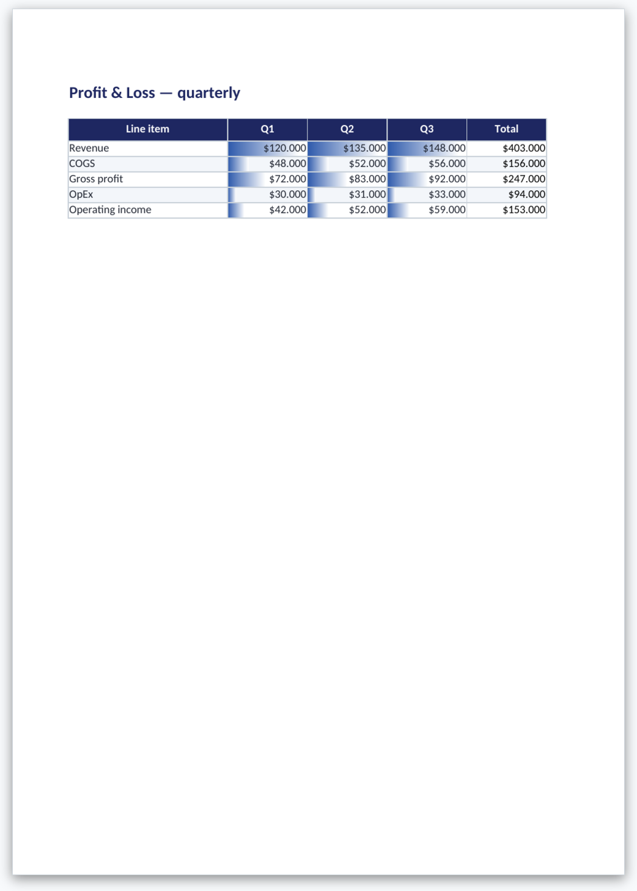

# NEURA Office

[](LICENSE)
[](https://github.com/open-webui/open-webui)
[](#the-three-tools)
[](https://ianustec.com)

**Native Word, PowerPoint and Excel from your LLM.**

NEURA Office is an open suite that turns model output into **real Office files**
you can open, edit and share. Not HTML exports. Not PDF screenshots. Not Markdown
dumped into a `.docx` zip.

Today it ships as three [Open WebUI](https://github.com/open-webui/open-webui)
tools. Next: **NEURA for Microsoft 365**, a WIP add-in that works inside Word,
Excel, PowerPoint and Outlook as a **private Copilot alternative** backed by
your Open WebUI ([details](#neura-for-microsoft-365-wip)). LibreOffice /
OpenOffice stay in scope where OOXML allows.

| | |
|---|---|
| **Who it is for** | Teams that self-host AI and need board-ready documents, decks and workbooks from chat |
| **What you get** | Editable `.docx`, `.pptx`, `.xlsx` with styles, charts, tables and download links in chat |
| **How it runs** | One `.py` file per tool, pasted into Open WebUI Tools. No sidecar services |
| **License** | MIT · [IANUSTEC](https://ianustec.com) |

---

## The problem

Ask an LLM for a report, a pitch or a budget and you usually get one of these:

1. **Markdown in the chat** (you reformat it by hand)
2. **HTML / PDF export** (looks fine, dies the moment someone wants to edit)
3. **A half-broken Office file** (wrong styles, empty slides, formulas as text)

That is fine for demos. It is not fine for work you send to a client, a board
or a public administration.

## What NEURA Office does instead

The model calls a tool. The tool builds a proper **Office Open XML** package
with the same libraries professionals use (`python-docx`, `python-pptx`,
`openpyxl`). Open WebUI saves the file and drops a **download link** in the chat.

You open it in Word, PowerPoint, Excel, LibreOffice, Pages, Keynote or Google
Sheets and keep editing like any normal document.

Think of it as the document half of a Copilot-style workflow, with a difference:

- your models
- your data / RAG
- your Open WebUI backend
- open source

---

## The three tools

Each tool lives in its own repo (releases, issues, versioning). This hub is the
suite overview.

| Tool | Output | Latest | Repository |
|------|--------|--------|------------|
| [Generate Documents](https://github.com/ianustec/openwebui-generate-documents) | `.docx` | [v1.2.0](https://github.com/ianustec/openwebui-generate-documents/releases/latest) | Word engine |
| [Generate Slides](https://github.com/ianustec/openwebui-generate-slides) | `.pptx` | [v1.0.2](https://github.com/ianustec/openwebui-generate-slides/releases/latest) | PowerPoint engine |
| [Generate Spreadsheets](https://github.com/ianustec/openwebui-generate-spreadsheets) | `.xlsx` | [v1.0.1](https://github.com/ianustec/openwebui-generate-spreadsheets/releases/latest) | Excel engine |

### 1. Generate Documents (Word)


*Native `.docx` from Markdown or JSON. Cover, headings, tables, callouts, TOC.*

The model writes Markdown (YAML frontmatter preferred) or a JSON spec. The tool
renders a real Word file with a coherent design system derived from one accent
color.

**Highlights**

- Cover styles: band, rule, plain
- Templates: report, whitepaper, proposal, letter, memo, minutes, blank
- Numbered headings, styled tables (filled header, zebra, numeric right-align)
- Callouts, code blocks, signatures, TOC, 3-zone header/footer with page numbers
- **Company letterhead**: reuse a `.docx` / `.dotx` from chat attachments or `/mnt/uploads`

Repo and docs: [openwebui-generate-documents](https://github.com/ianustec/openwebui-generate-documents)



### 2. Generate Slides (PowerPoint)


*Native `.pptx` with layouts, icons and Office charts. Not HTML-to-image slides.*

The model emits a JSON deck. The tool builds editable PowerPoint with layered
shapes, curated themes and charts that remain charts when you open the file.

**Highlights**

- ~25 layouts (cover, section, KPI, comparison, timeline, funnel, quote, closing, …)
- Native charts: bar, line, area, pie, doughnut, radar, stacked
- Lucide-style icons baked into the file (no CDN at open time)
- Themes + custom accent; optional Unsplash / Open WebUI images

Repo and docs: [openwebui-generate-slides](https://github.com/ianustec/openwebui-generate-slides)



### 3. Generate Spreadsheets (Excel)


*Native `.xlsx` with Tables, live formulas and charts. Excel recalculates on open.*

The model emits a JSON workbook. The tool writes sheets, styles, validations and
formula strings. No LibreOffice needed inside the Open WebUI container.

**Highlights**

- Multi-sheet workbooks with accent-colored tabs
- Excel Tables, freeze panes, filters, data validation
- Live formulas (recalculated by Excel / LibreOffice when opened)
- Native charts and conditional formatting

Repo and docs: [openwebui-generate-spreadsheets](https://github.com/ianustec/openwebui-generate-spreadsheets)



---

## How it fits together

```
┌─────────────────────────────────────────────────────────┐
│  You (chat in Open WebUI, or later MS365 task pane)     │
└───────────────────────────┬─────────────────────────────┘
                            │
                            ▼
┌─────────────────────────────────────────────────────────┐
│  Open WebUI  (models, RAG, tools, auth, files API)      │
└───────────────────────────┬─────────────────────────────┘
                            │
          ┌─────────────────┼─────────────────┐
          ▼                 ▼                 ▼
   generate_document  generate_slides  generate_spreadsheet
          │                 │                 │
          ▼                 ▼                 ▼
        .docx             .pptx             .xlsx
          │                 │                 │
          └─────────────┬───┴─────────────────┘
                        ▼
              Download link in chat
         (Word / Excel / PowerPoint /
          LibreOffice / Google Sheets)
```

This repository (`neura-office`) does **not** copy the tool source. It links the
three engines, explains the suite and tracks the roadmap (including MS365).

```
neura-office/                         ← hub (this repo)
├── openwebui-generate-documents      ← Word tool (separate repo)
├── openwebui-generate-slides         ← PowerPoint tool
└── openwebui-generate-spreadsheets   ← Excel tool
```

---

## Install (Open WebUI)

Works on Open WebUI `>= 0.4.0`. Each tool is one self-contained Python file.
Dependencies are declared in the file frontmatter and installed by Open WebUI
on first use.

### Option A. From the Open WebUI community

Search for **Generate Documents**, **Generate Slides** or **Generate Spreadsheets**
(IANUSTEC) and import into your instance.

Notes for maintainers: [`community/openwebui.md`](community/openwebui.md)

### Option B. From GitHub

1. Open the component repo and copy the `.py` file
2. In Open WebUI go to **Workspace → Tools → +**
3. Paste, save, enable the tool for your model
4. Ask for a report, a deck or a workbook

The reply includes a download link (Files API, with `/cache/files` fallback).

---

## Compatibility

Files are **OOXML** (the open Office format family), not a Microsoft-only lock-in.

| Format | Microsoft Office | LibreOffice / OpenOffice | Notes |
|--------|------------------|--------------------------|-------|
| `.docx` | Yes | Yes | Check letterhead and complex covers |
| `.pptx` | Yes | Partial | Charts and some layered shapes can differ |
| `.xlsx` | Yes | Yes | Formulas recalculate when you open the file |

We optimize for Microsoft Office first. LibreOffice stays in scope because we
write standards-based packages. Details and how to report gaps:
[`libreoffice.md`](libreoffice.md).

---

## Compared to the usual alternatives

| Approach | Editable in Word/Excel? | Charts / styles | Self-hosted |
|----------|-------------------------|-----------------|-------------|
| Markdown in chat | No (copy-paste) | Manual | Yes |
| HTML / PDF export | Poor / no | Fixed | Depends |
| Cloud Copilot | Yes | Yes | No (vendor stack) |
| **NEURA Office** | Yes | Native where possible | Yes |

---

## NEURA for Microsoft 365 (WIP)

**Status: work in progress.** Not released yet. Progress and design notes stay
anchored to **this repository** ([`apps/ms365.md`](apps/ms365.md)).

The next layer of NEURA Office is a **Microsoft 365 add-in**: an assistant that
lives inside the apps people already use, in the place they expect **Copilot**,
but pointed at **your** stack.

| | Copilot (Microsoft) | NEURA for Microsoft 365 |
|---|---|---|
| Where it appears | Word, Excel, PowerPoint, Outlook | Same apps |
| Backend | Microsoft cloud | **Your Open WebUI** |
| Models / RAG / tools | Vendor-controlled | Yours (same as chat today) |
| Document engines | Microsoft | Same NEURA Office generators (`.docx` / `.pptx` / `.xlsx`) |
| Data path | Leaves your tenant toward Copilot services | Stays on your Open WebUI deployment |

**What it will let you do**

- Work on **Word**, **Excel**, **PowerPoint** and **Outlook** from a side panel
- Draft, rewrite and generate native Office files without leaving the app
- Reuse the same Open WebUI models, knowledge and tools you already trust in chat
- Keep the workflow **private / self-hosted**: compatible with Open WebUI as the
  brain, instead of a public Copilot subscription

**What is live today**

The three Open WebUI tools above. They are the generation engines the add-in
will call. You can already produce Word / PowerPoint / Excel from chat while
the MS365 shell is being built.

**What is not ready**

- Installable add-in package
- Store / tenant deployment guides
- Public beta dates

Follow [`apps/ms365.md`](apps/ms365.md) and open a Discussion with tag `ms365`
if you want early access.

---

## Roadmap

| Phase | Status | Focus |
|-------|--------|--------|
| **Now** | Live | Three Open WebUI tools (Word, PowerPoint, Excel) |
| **Next** | In progress | Shared polish, more templates, LibreOffice QA pack |
| **Later** | WIP | **NEURA for Microsoft 365** add-in (Copilot alternative on Open WebUI), tracked in this repo |

Full plan: [`ROADMAP.md`](ROADMAP.md)

---

## Why “NEURA”?

NEURA is the **AI infrastructure** we build at IANUSTEC: sovereign / self-hosted
AI with Open WebUI as a core frontend and orchestration layer.

NEURA Office is the Office layer of that stack. The name is intentional: the
tools are useful on their own, and they also point to the broader infrastructure
story.

More: [`WHY-NEURA.md`](WHY-NEURA.md)

---

## Contributing and feedback

- Bugs and features for a specific format → open an issue on that component repo
- Suite / roadmap / MS365 interest → Discussions or issues on **this** repo
- LibreOffice mismatches → include version, OS and a screenshot ([guide](libreoffice.md))

## Links

- [IANUSTEC](https://ianustec.com)
- [Open WebUI](https://github.com/open-webui/open-webui)
- [Generate Documents](https://github.com/ianustec/openwebui-generate-documents)
- [Generate Slides](https://github.com/ianustec/openwebui-generate-slides)
- [Generate Spreadsheets](https://github.com/ianustec/openwebui-generate-spreadsheets)

## License

MIT. Each component repo carries its own `LICENSE` file. This hub is MIT as well
([`LICENSE`](LICENSE)).
